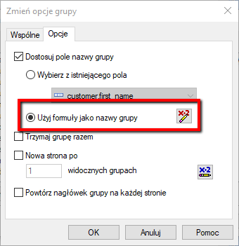
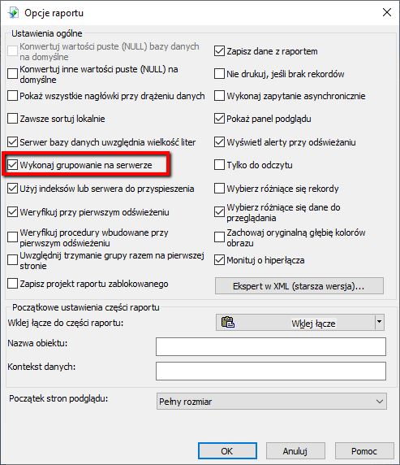
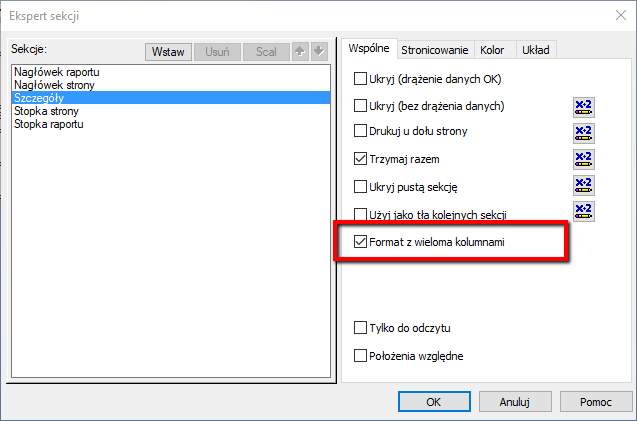
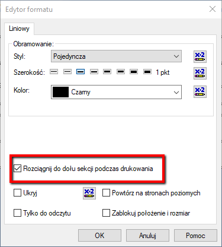
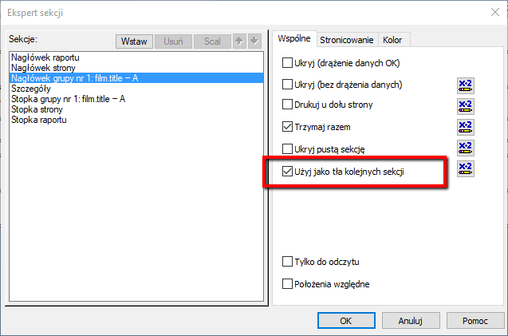
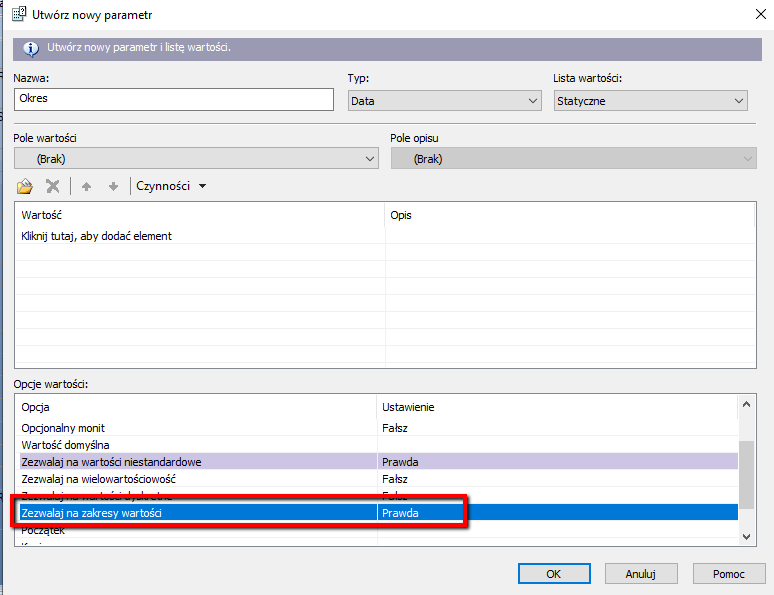
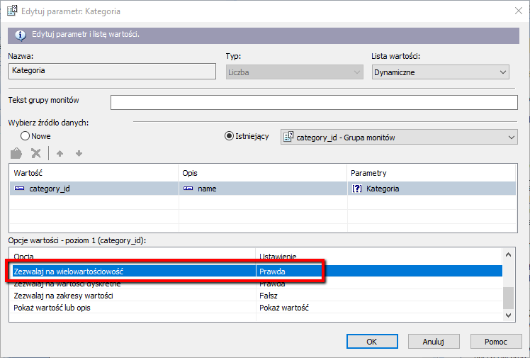

# Vavatech.ZUS.CrystalReports
Przykładowe raporty ze szkolenia Crystal Reports dla zaawansowanych

- Blog Crystal Reports
http://sulmar.blogspot.com

- Crystal Reports Viewer 
https://www.crystalreports.com/crystal-viewer/

- Grupa Crystal Reports
https://www.goldenline.pl/grupy/Komputery_Internet/crystal-reports/

- Funkcje Crystal Reports
Funkcje Crystal Reports.pdf

# Opcje

## Grupowanie

### Dostosowanie nazwy grupy

## Optymalizacja

## Grupowanie po stronie serwera

## Formatowanie

### Formatowanie wielokolumnowe

### Wyrównywanie linii

## Sekcje
### Sekcja przeźroczysta

## Parametry

### Parametr zakresowy

### Parametr wielowartościowy

